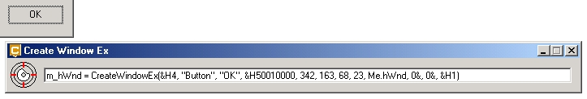



## Create Window Ex 1\.0

### Description

Make Create Window Ex in drag operations of an icon in your form.

This program seeks you to put to have the function CreateWindowEx in an easy and fast way, allowing you to put only more the own function in API, in his source-code.
 
### More Info
 
It is alone you to take the mouse until the icon of the program and dragging for any window for him to copy the properties of the element in focus for the function CreateWindowEx.

dwExStyle,lpClassName,lpWindowName,dwStyle,x,y,nWidth,nHeight,ID

             |
---                |---
**Submitted On**   |2007-09-05 00:10:16
**By**             |[Fernando Macedo](https://github.com/Planet-Source-Code/PSCIndex/blob/master/ByAuthor/fernando-macedo.md)
**Level**          |Advanced
**User Rating**    |5.0 (10 globes from 2 users)
**Compatibility**  |VB 6\.0
**Category**       |[Complete Applications](https://github.com/Planet-Source-Code/PSCIndex/blob/master/ByCategory/complete-applications__1-27.md)
**World**          |[Visual Basic](https://github.com/Planet-Source-Code/PSCIndex/blob/master/ByWorld/visual-basic.md)
**Archive File**   |[Create\_Win208208952007\.zip](https://github.com/Planet-Source-Code/fernando-macedo-create-window-ex-1-0__1-69274/archive/master.zip)

### API Declarations

CreateWindowEx

